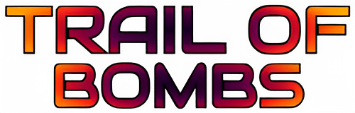
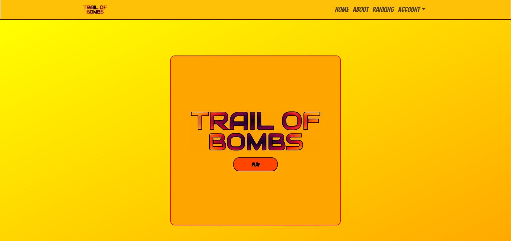
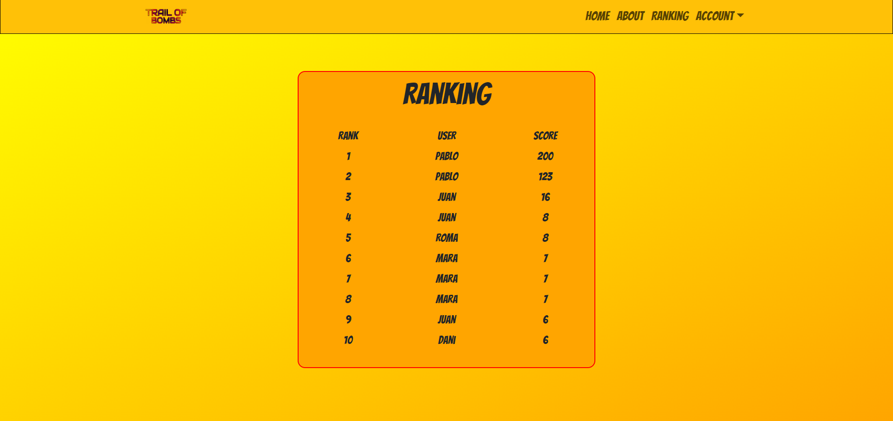

<h1 align="center">☾ - TRAIL OF BOMBS FRONTEND - ☽</p></h1>

---



---
### ✪ [Enlace al repositorio](https://github.com/PabloProst/tob_frontend/tree/master/finalfrontend)
### ✪ [Enlace a mi Linkedin](https://www.linkedin.com/in/pablo-ezequiel-prost-926ab6297/)

---

## ⚘ Desarrollo:

``` js
 const developer = "PabloProst";

 console.log("Desarrollado por: " + PabloProst);
```  
---

## &nbsp;&nbsp;&nbsp;&nbsp;&nbsp;&nbsp;&nbsp;&nbsp;&nbsp;&nbsp;&nbsp;&nbsp;&nbsp;&nbsp;&nbsp;&nbsp;&nbsp;&nbsp;&nbsp;&nbsp;&nbsp;&nbsp;&nbsp;&nbsp;&nbsp;&nbsp;&nbsp;&nbsp;&nbsp;&nbsp;&nbsp;&nbsp;&nbsp;&nbsp;&nbsp;&nbsp;:mag: OBJETIVO :mag:

#### ▫︎ FRONTEND REALIZADO ACOMPAÑADO DE SU BACKEND CORRESPONDIENTE ▫︎.
#### Se trata de una web de un juego en el que debes seleccionar la casilla correspondiente sin tocar la bomba oculta.

---

## Tecnologías utilizadas:

#### ✒︎ HTML
#### ✒︎ CSS
#### ✒︎ JAVASCRIPT
#### ✒︎ BOOSTRAP
#### ✒︎ GITHUB
#### ✒︎ REACT

---
## &nbsp;&nbsp;&nbsp;&nbsp;&nbsp;&nbsp;&nbsp;&nbsp;&nbsp;&nbsp;&nbsp;&nbsp;&nbsp;&nbsp;&nbsp;&nbsp;&nbsp;&nbsp;&nbsp;&nbsp;&nbsp;&nbsp;&nbsp;&nbsp;&nbsp;&nbsp;:rocket: HOME PAGE :rocket:




---

## :gear: VISTAS :gear:
#### ✒︎ HOME
#### ✒︎ LOGIN/REGISTER
#### ✒︎ PROFILE
#### ✒︎ ABOUT
#### ✒︎ RANKING
----


----

## :gear: RESPONSIVE :gear:

#### La aplicación es completamente responsive, facilitando su visualización en PC y móviles.


---

## :mag: A MEJORAR :mag:

#### En un futuro la aplicación contará con un mejor diseño ya que el que trae es muy básico.
#### Se removerán líneas de código que no están en uso y se le añadirán funciones a la aplicación.
 
#### También se agregarán comentarios cuando la contraseña o el email son incorrectos al momento de loguearse.

---
## ✦ Licencia ✦
Este proyecto se encuentra bajo licencia de "Pablo Prost"